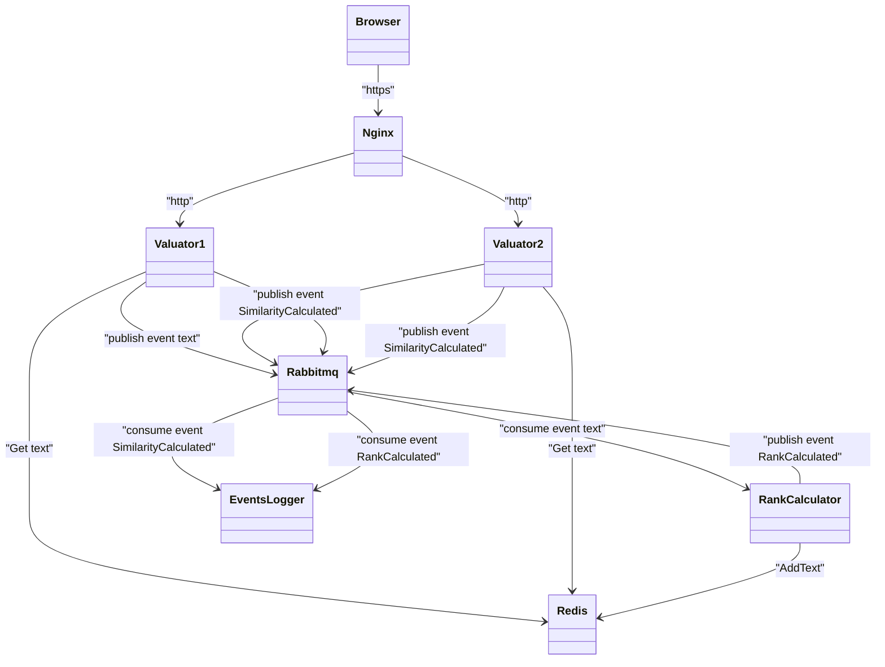

```mermaid
classDiagram
    Browser --> Nginx: "https"

    Nginx --> Valuator1: "http"
    Nginx --> Valuator2: "http"

    Valuator1 --> Rabbitmq: "publish event text"
    Valuator2 --> Rabbitmq: "publish event text"
    Valuator1 --> Rabbitmq: "publish event SimilarityCalculated"
    Valuator2 --> Rabbitmq: "publish event SimilarityCalculated"
    Valuator1 --> Redis: "Get text"
    Valuator2 --> Redis: "Get text"

    Rabbitmq --> RankCalculator: "consume event text"
    RankCalculator --> Redis: "AddText"
    RankCalculator --> Rabbitmq: "publish event RankCalculated"

    Rabbitmq --> EventsLogger: "consume event SimilarityCalculated"
    Rabbitmq --> EventsLogger: "consume event RankCalculated"
```