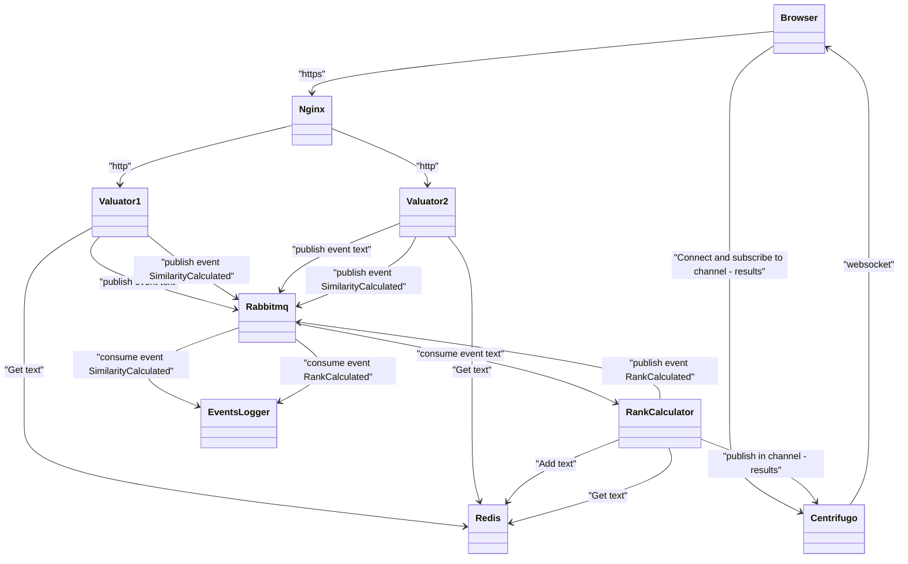

```mermaid
classDiagram
    Browser --> Nginx: "https"
    Browser --> Centrifugo: "Connect and subscribe to channel - results"

    Centrifugo --> Browser: "websocket"

    Nginx --> Valuator1: "http"
    Nginx --> Valuator2: "http"

    Valuator1 --> Redis: "Get text"
    Valuator1 --> Rabbitmq: "publish event text"
    Valuator1 --> Rabbitmq: "publish event SimilarityCalculated"

    Valuator2 --> Redis: "Get text"
    Valuator2 --> Rabbitmq: "publish event text"
    Valuator2 --> Rabbitmq: "publish event SimilarityCalculated"

    Rabbitmq --> RankCalculator: "consume event text"
    RankCalculator --> Redis: "Add text"
    RankCalculator --> Redis: "Get text"
    RankCalculator --> Rabbitmq: "publish event RankCalculated"
    RankCalculator --> Centrifugo: "publish in channel - results"

    Rabbitmq --> EventsLogger: "consume event SimilarityCalculated"
    Rabbitmq --> EventsLogger: "consume event RankCalculated"
```